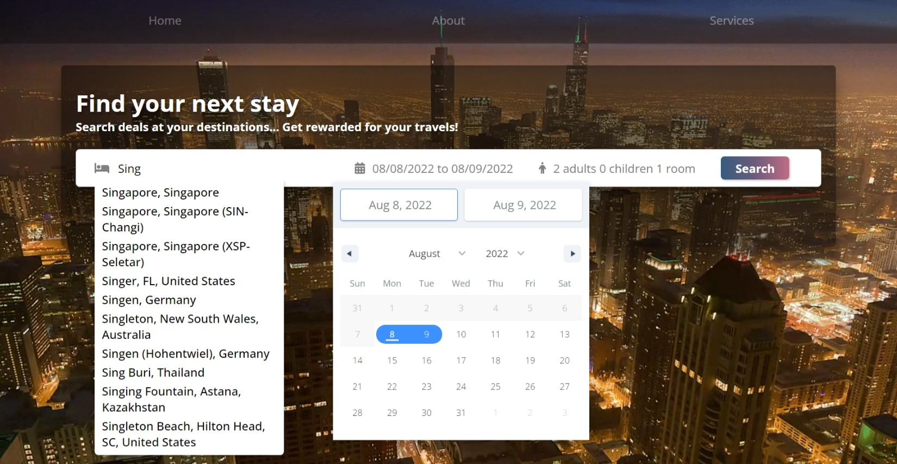
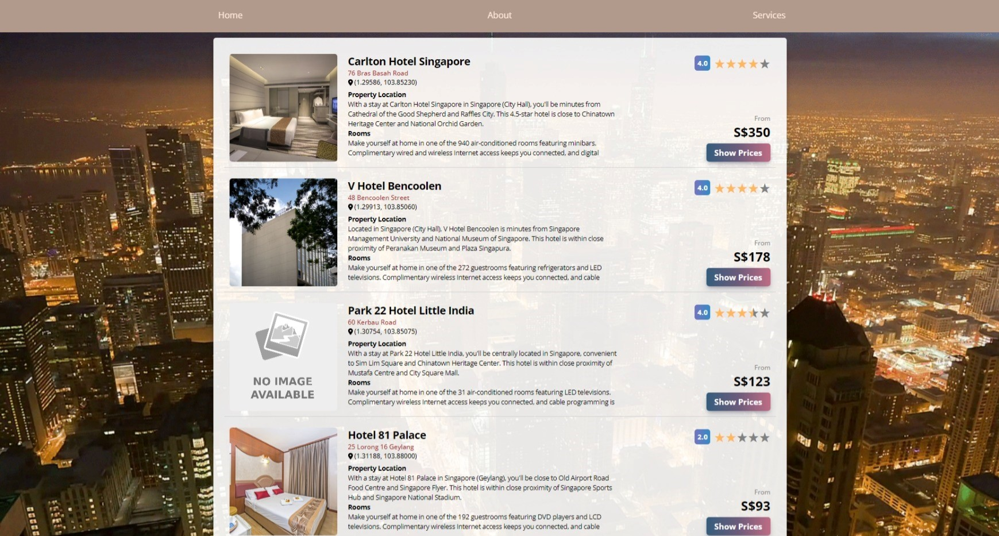
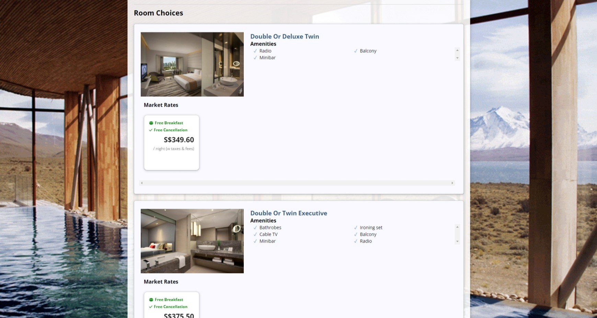
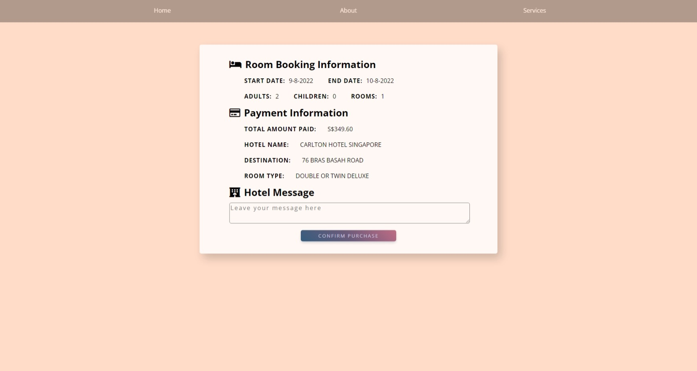
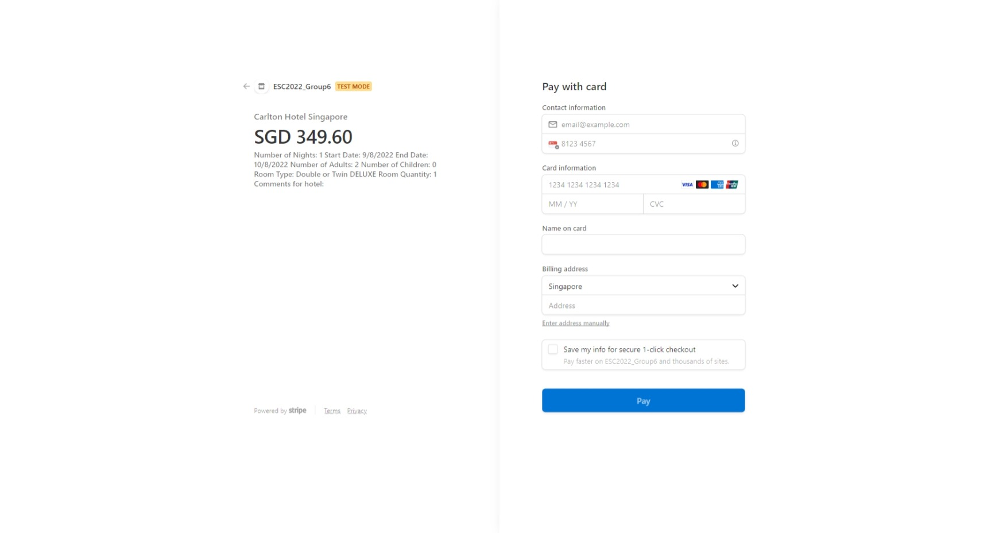
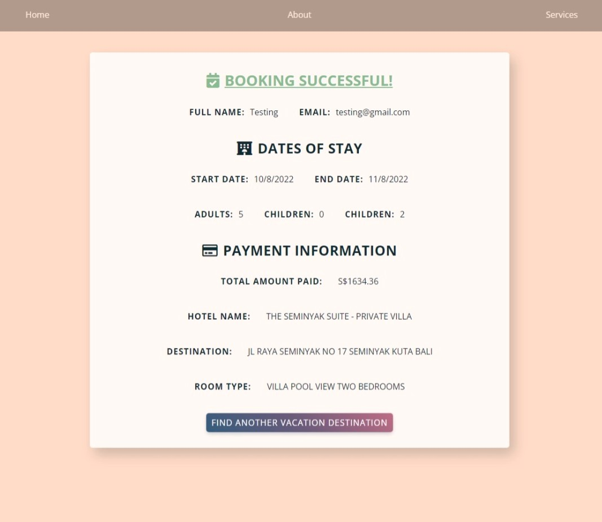

<h1 align="center" style="border-bottom: none">
    <b>Ascenda Loyalty Hotel Booking System</b>
    <br>
    2022 50.003 Elements of Software Construction
    <br>
</h1>

<p align="center">
    A hotel booking system built using the MERN framework (MongoDB, Express, React, Node)
</p>

<div align="center">

[](https://npmjs.com/package/express)
[](https://reactjs.org/)
[](https://www.typescriptlang.org/)
</div>

<table align="center">
<b> Cohort 1 Group 6: </b>
  <tr>
    <td align="center"><a href="https://github.com/bloomspx"><br /><sub><b>Soh Pei Xuan</b><br/> 1005552</sub></a><br/>
    <td align="center"><a href="https://github.com/MasonGYC"><br /><sub><b>Guo Yuchen</b><br/> 1004885</sub></a><br />
    <td align="center"><a href="https://github.com/Ignite99"><br /><sub><b>Nicholas Goh</b><br/> 1005194</sub></a><br />
    <td align="center"><a href="https://github.com/dellebew"><br /><sub><b>Adelle Chan</b><br/> 1005418</sub></a><br />
  </tr>
</table>

# Table of Contents
-   [Getting Started](#getting-started)
-   [Features](#features)
    -   [Destination Search](#mag-destination-search)
    -   [Hotel Search Results](#tokyotower-hotel-search-results)
    -   [Hotel Room Details](#hotel-hotel-room-details)
    -   [Booking Data](#calendar-booking-data)
-   [API Calling](#api-calling)
-   [File Directories](#file-directories)
-   [External Resources](#external-resources)

# Getting Started
### 1. Install React and Node.js
### 2. Install Node and Python dependencies 

```
pip install -r requirements.txt 

cd api       
npm install

cd client      
npm install
```
### 3. Running Web Server
To begin running the web application, first start a new terminal and run the backend Express server (http://localhost:8080/)
```
cd api
npm start
```
Subequently, start another terminal and run the frontend React server (http://localhost:3000/)
```
cd client   
npm start
```

# Features

## :mag: Destination Search
Text-based autocomplete search that facilitates a fast return of relevant destinations. Accompanied with a datepicker and dropdown for number of guests and rooms.

http://localhost:3000/ <br>
 

## :tokyo_tower: Hotel Search Results
Given a set of parameters (e.g. destination, dates, no. of guests, no. of rooms), provides a list of avaliable hotels, with description and lowest price (paginated). 

`http://localhost:3000/destinations/destId/checkInDate/checkOutDate/en_US/SGD/SG/adultQty/childrenQty/roomQty/pageNo` <br>
:heavy_check_mark: http://localhost:3000/destinations/RsBU/2022-08-09/2022-08-10/en_US/SGD/SG/2/0/1/0 <br>
 

## :hotel: Hotel Room Details
Given a set of parameters and particular hotel, provides a list of all matching room listings, prices and description. Accompanied with Pigeon Maps API for hotel location and hotel details.

`http://localhost:3000/hotels/hotelId/destId/checkInDate/checkOutDate/en_US/SGD/SG/adultQty/childrenQty/roomQty` <br>
:heavy_check_mark: http://localhost:3000/hotels/S57Q/RsBU/2022-08-09/2022-08-10/en_US/SGD/SG/2/0/1 <br>

<p float="left">
  
   
</p>

## :calendar: Booking Data
By clicking on a room rate card, customers will be redirected to a booking confirmation page and can perform payment through Stripe API. Booking data will also be stored in local database.

`http://localhost:3000/checkout` <br>
<p float="left">
  
   
</p>
<p float="left">
  
   
</p>

# API Calling
Our backend server makes API calls `api\routes\api.js` to Ascenda's API using the following format:
### 1. Hotel Static Data: 
`http://localhost:8080/api/hotel/:id` <br>
:heavy_check_mark: http://localhost:8080/api/hotel/diH7

### 2. Hotel Static Data for a Given Destination: 
`http://localhost:8080/api/destination/hotels/:id/:page` <br>
:heavy_check_mark: http://localhost:8080/api/destination/hotels/4FBY/0 

### 3. Room Prices for a Given Hotel: 
`http://localhost:8080/api/hotel/price/:hotelid/:destinationid/:checkin/:checkout/:lang/:currency/:countrycode2/:guestnumber` <br>
:heavy_check_mark: http://localhost:8080/api/hotel/price/diH7/WD0M/2022-08-25/2022-08-29/en_US/SGD/SG/2 

### 4. Hotel Prices for a Given Destination: <br>
`http://localhost:8080/api/destination/prices/:destinationid/:checkin/:checkout/:lang/:currency/:countrycode2/:guestnumber/:page` <br>
:heavy_check_mark: http://localhost:8080/api/destination/prices/FkG9/2022-08-25/2022-08-26/en_US/SGD/ES/2/0

# File Directories
```
📦api                  # backend Express files
 ┣ 📂bin
 ┣ 📂controllers       # individual routing controllers
 ┣ 📂node_modules
 ┣ 📂public
 ┣ 📂routes            # api.js, routing for backend
 ┣ 📂stripe            # stripe integration for backend
 ┣ 📂views
 ┣ 📜app.js
 📦client              # frontend React files
 ┣ 📂node_modules
 ┣ 📂public            # images used in webapp
 ┣ 📂src
 ┃ ┣ 📂components      # building blocks for webpage
 ┃ ┃ ┗ 📂utils         # api call function, url checker
 ┃ ┣ 📂database        # static JSON data
 ┃ ┣ 📂pages           # main webpages: hotel, home, error, dest
 ┃ ┣ 📜App.js
 ┃ ┗ 📜index.js
 📦media               # webpage screenshots
 📦testing             # selenium and jmeter testing files
 📜README.md
 📜requirements.txt    # python dependencies
 📜stripe-merging
 ```

# External Resources
- [Date-FNS](https://date-fns.org/)
- [FontAwesomeIcon](https://fontawesome.com/icons)
- [Pigeon-Maps](https://github.com/mariusandra/pigeon-maps)
- [React-Confirm-Alert](https://github.com/GA-MO/react-confirm-alert)
- [React-Date-Range](https://hypeserver.github.io/react-date-range/)
- [React-Paginate](https://www.npmjs.com/package/react-paginate)
- [React-Rating-Stars](https://www.npmjs.com/package/react-rating-stars-component)
- [Stripe](https://stripe.com/docs/api)

